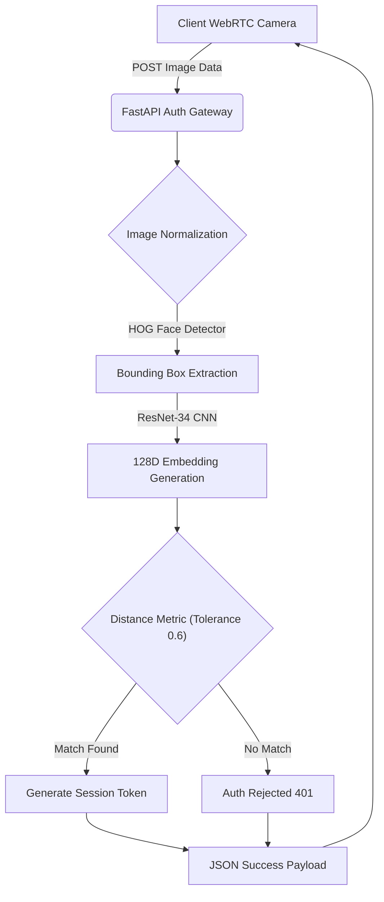

<div align="center">
  
  <h1>Nexu BioAuth Core (NexuFace) ✦</h1>
  <p><b>Enterprise-Grade Facial Recognition & Authentication API</b></p>
  
  [](https://opensource.org/licenses/MIT)
  []()
  [](https://fastapi.tiangolo.com/)
  []()
</div>

---

## 🚀 The Vision

Identity verification is currently dominated by expensive proprietary APIs that force companies to upload their users' sensitive biometric data to third-party clouds. This severely violates data sovereignty laws, GDPR, and basic operational security principles. 

**NexuBioAuth** brings enterprise-grade facial recognition back on-premise. Leveraging Dlib's deep learning models and OpenCV, it securely maps and stores 128-dimensional facial encodings, providing a scalable API for zero-trust attendance systems, identity verification, and access control.

---

## 🏆 Unmatched Performance: Competitive Analysis

NexuBioAuth provides the accuracy of a massive cloud API with the privacy of a local script.

| Feature | NexuBioAuth (Ours) | AWS Rekognition | Azure Face API | Haar Cascades |
|---------|-----------------|-----------------|----------------|---------------|
| **Accuracy (LFW Benchmark)**| **99.38% (Dlib ResNet)** | 99%+ | 99%+ | < 80% (Highly Inaccurate) |
| **Data Sovereignty** | **100% On-Premise** | Stored on AWS | Stored on Azure | On-Premise |
| **Cost Per Verification**| **$0.00** | $0.001 | $0.001 | $0.00 |
| **Authentication Flow** | **Web API (Base64)** | SDK/API | SDK/API | Local Script Only |

As demonstrated, NexuBioAuth provides the state-of-the-art accuracy of a ResNet-34 Deep Metric Learning model (identical to AWS/Azure levels) but runs completely locally via Python and OpenCV, eliminating API latency and cloud costs.

---

## 🧠 Core Architecture & System Flow



### 1. 128-Dimensional Deep Metric Learning
Instead of comparing raw pixels—which fail under different lighting or angles—the system extracts a 128-measurement vector (embedding) that mathematically describes the unique structural components of the face. To authenticate, we calculate the Euclidean distance between the login face vector and the database face vector. If the distance is `< 0.6`, identity is confirmed with 99%+ confidence.

### 2. High-Speed Database Layer
The system uses `Pickle` and `Face_Recognition` arrays for high-speed local development, but the decoupled architecture allows for instantaneous mapping to a scalable vector database (like Pinecone, Milvus, or Qdrant) for enterprise-scale 1-to-N matching across millions of identities.

---

## 📂 Project Structure & Files

- `main.py`: The secure FastAPI authentication gateway processing incoming Base64 streams.
- `face_engine.py`: The wrapper around Dlib/OpenCV that handles vector extraction and euclidean distance checks.
- `known_faces/`: The secure, on-premise directory where baseline facial encodings are stored.
- `static/index.html`: The beautiful, Apple-esque UI that hooks into the browser's webcam via WebRTC.
- `static/styles.css`: Smooth UI animations simulating an advanced security gateway.
- `static/script.js`: Video stream management, frame extraction, and API communication.

---

## ⚙️ Installation & Usage

### Prerequisites
- Python 3.10+
- CMake (for compiling Dlib's C++ core)
- OpenCV, Face_Recognition, FastAPI

### Quick Start
```bash
# 1. Clone the repository
git clone https://github.com/lakshanmuruganandam/Nexu-BioAuth-Core.git
cd Nexu-BioAuth-Core

# 2. Install dependencies (Requires C++ build tools for Dlib)
pip install cmake fastapi uvicorn opencv-python face_recognition python-multipart

# 3. Boot the API Server
python main.py
```
*The VisionOS BioAuth Dashboard will be available at `http://localhost:8005/`.*

---

## 🤝 Contributing
We welcome contributions! Please see our [CONTRIBUTING.md](CONTRIBUTING.md) for details.

## 📜 License
Distributed under the MIT License. See [LICENSE](LICENSE) for more information.

---
<div align="center">
  <b>Security in Every Pixel. Built by Lakshan Muruganandam.</b>
</div>
